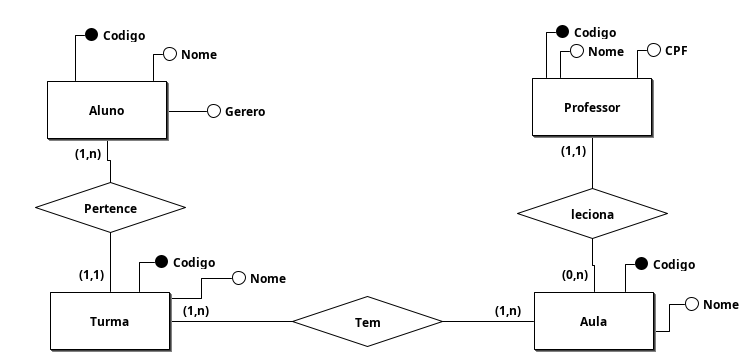
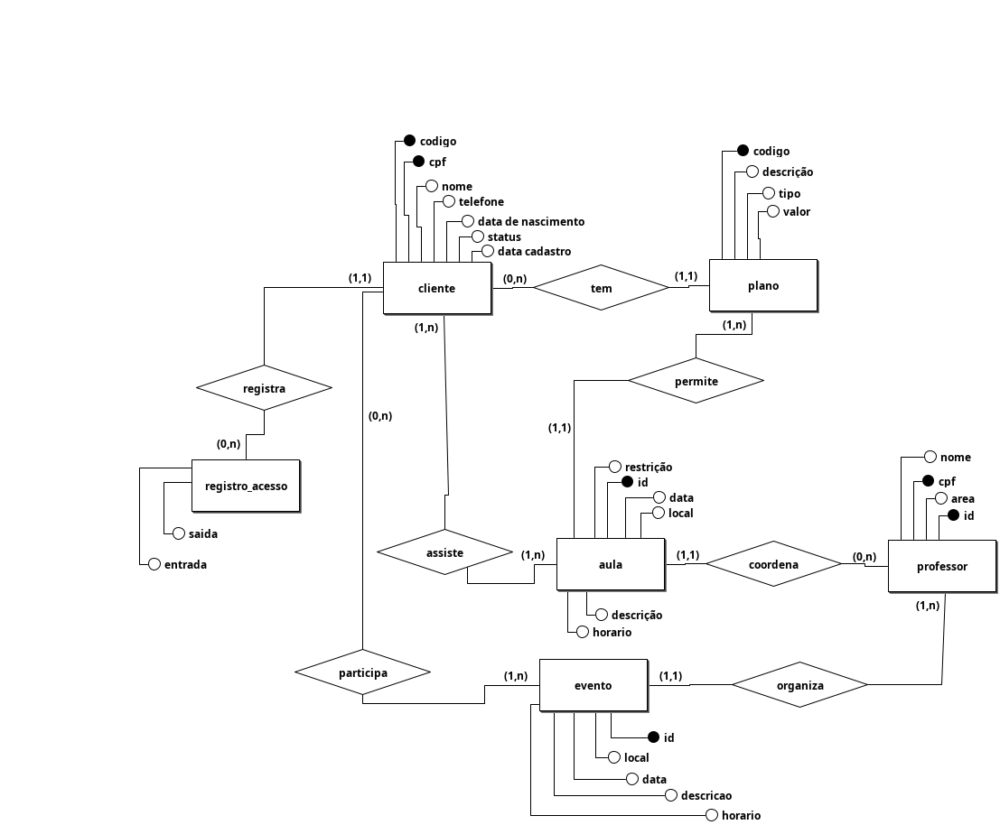

# AULA 04 - 31/08 - EXERCÍCIOS

- [BR Modelo Download](https://brmodelo.org/)

### MER Curso Inglês 

- [Estudo de Caso - Curso Inglês](./exercicio%20-%20Curso.pdf)

### MER FIT CONTROL (Resposta enviado pelo Henrico)

- [Estudo de Caso - FitControl](./exercicio%20-%20FitControl.pdf)

##### (Resposta enviado pelo Henrico)

- [Estudo de Caso - Sapataria](./exercicio%20-%20Sapataria.pdf)
